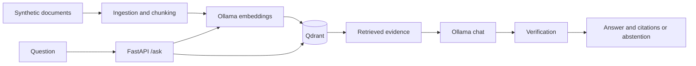

# On-Prem RAG Assistant

Local RAG backend using FastAPI, Qdrant and Ollama. No cloud LLM API is required.

This repository is a sanitized public portfolio extraction of a larger private on-premise project. Proprietary documents, credentials and infrastructure-specific configuration are intentionally excluded.

## Overview

The example uses five synthetic documents for a fictional electronics store. It loads Markdown, creates deterministic chunks, embeds them with Ollama, stores vectors in Qdrant, retrieves evidence, and returns a grounded answer with citations or a safe abstention.

## Architecture



## What it demonstrates

- Heading-first deterministic chunking adapted from a real RAG implementation.
- Local embeddings, cosine vector search, and grounded generation.
- Citation IDs checked against retrieved chunks and a conservative answer gate.
- Offline unit tests, a measured evaluation runner, Docker Compose, and CI.

## Quick start

Install [Docker](https://docs.docker.com/get-docker/) and [Ollama](https://ollama.com/download). Start Ollama on the host, then pull the configured models:

```bash
ollama pull nomic-embed-text
ollama pull qwen3.5:9b
cp .env.example .env
docker compose up -d --build
docker compose exec api python -m on_prem_rag.ingestion sample_data/
```

The API listens on `http://127.0.0.1:8000`; Qdrant listens on `http://127.0.0.1:6333`. On Linux, Compose maps `host.docker.internal` to the host gateway. Ollama must accept connections from Docker; configure its bind address for your trusted local environment. Model names and endpoints can be changed in the ignored `.env` file. The ingestion command upserts stable point IDs into `QDRANT_COLLECTION`; use a dedicated collection for this demo. If source files are removed or changed, old points may remain until the collection is cleared separately.

## API example

```bash
curl http://127.0.0.1:8000/health
curl -s http://127.0.0.1:8000/ask -H 'Content-Type: application/json' \
  -d '{"question":"Aká je lehota na vrátenie produktu?"}'
```

A successful response has `answer`, `confidence`, and `sources` with `document`, `chunk_id`, and `snippet`. When evidence or verification is insufficient, the response is `{"answer":"Informáciu som v dostupných dokumentoch nenašiel.","confidence":"low","sources":[]}`. Dependency failures return HTTP 503 with a generic message.

## Evaluation

`eval/questions.jsonl` contains 20 synthetic questions: 15 answerable and 5 intentionally unanswerable. With the API and models running:

```bash
python -m pip install -e '.[dev]'
python eval/evaluate.py --api http://127.0.0.1:8000
```

The runner computes answer correctness by expected keywords, citation correctness by document name, abstention correctness, and average end-to-end latency. Request failures count as incorrect cases and are reported separately. Use `--details /tmp/rag-eval-details.jsonl` to keep per-question diagnostics outside Git.

### Measured local run

Measured on an owner-controlled local GPU system on 2026-09-29 after ingesting 11 synthetic chunks into a fresh isolated Qdrant collection. Retrieval threshold: `0.35`.

| Metric | Result |
|---|---:|
| Questions | 20 |
| Answer correctness | 20/20 |
| Citation correctness | 20/20 |
| Abstention correctness | 5/5 |
| Request errors | 0 |
| Average end-to-end latency | 4.98 s |

Runtime models: chat `qwen3.5:9b`; embeddings `qwen3-embedding:8b`.

These numbers describe one local run of the synthetic questions. Correctness is checked against the listed keywords and expected source document; it is not a general benchmark of RAG quality. Results depend on the configured models and runtime load.

## Tests

```bash
python -m pip install -e '.[dev]'
ruff check .
pytest
```

Unit tests use fakes and do not require Ollama or Qdrant. CI runs these same checks on Python 3.11.

## Project structure

`src/on_prem_rag/` contains the API, ingestion, adapters, pipeline, and verifier. `sample_data/` contains synthetic Markdown. `eval/` contains measured evaluation cases and runner. `tests/` contains offline tests.

## Security and privacy boundaries

Only the synthetic documents are included. The API exposes filenames and excerpts from ingested documents, so ingest only content you intend to expose. No authentication is included. Docker publishes the API and Qdrant only on loopback. Configuration belongs in ignored `.env` files; no credentials are required for the example.

## Limitations

The evidence gate checks citations and requires substantive answer tokens to occur in cited excerpts. It is conservative, but it cannot prove full semantic entailment. A vector score threshold alone cannot reliably identify every unanswerable question. Re-ingestion upserts stable points but does not remove chunks that disappeared from the input.

## Roadmap

Improve semantic verification, add safe stale-point reconciliation for the dedicated demo collection, and repeat evaluation across different local models.
